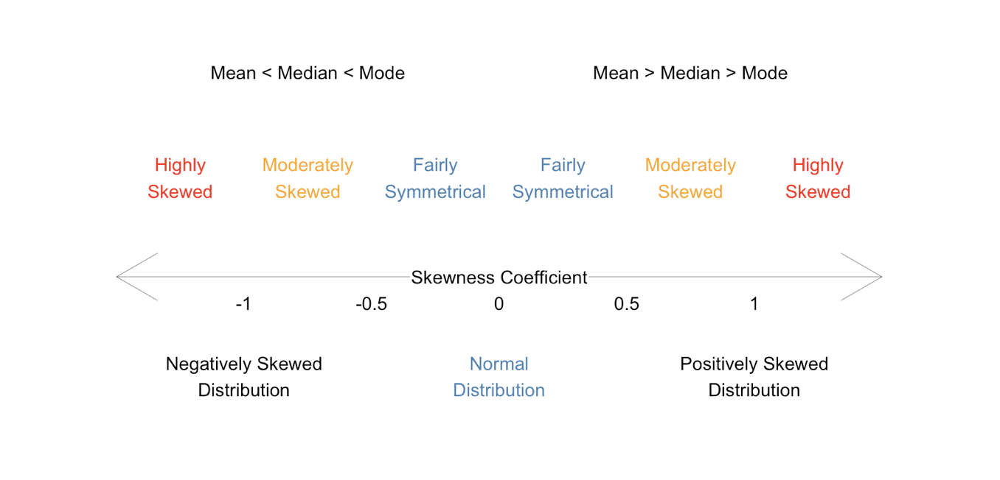

# What is Skewness?

Skewness is an important statistical concept in the field of data analytics that every statistician and data scientist needs to know. As you are reading this post, I am sure you will understand the concept of skewness and why it is important in data analytics by the end of this post.

Skewness is a measure of the asymmetry of the probability distribution. In other words, skewness is a measure to describe the deviation of the distribution of the data from a normal distribution. Have a glance at the below graphs for comparing normal distribution with the skewed distribution.

```{r echo=FALSE, fig.width=10, message=FALSE, warning=FALSE}
library(tidyverse)
df <- data.frame(x = c(rbeta(100000,2,5),rbeta(100000,5,5),rbeta(100000,5,2)),
           type = rep(c(1, 2, 3), each =  100000 )) %>% 
  mutate(type = factor(type, labels = c("Positively Skewed", "Normal (no skew)", "Negatively Skewed")))

label <- data.frame(type = unique(df$type),
           text = c("Mean > Median > Mode", "Mean = Median = Mode", "Mean < Median < Mode"))

df %>% 
  ggplot(aes(x = x, y = ..density..)) +
  geom_histogram(aes(fill = type), color = 'gray', alpha = 1) +
  geom_density(size = 0.7, color = 'black') +
  facet_wrap(~type, nrow = 1) +
  ylim(c(0, 2.75)) +
  geom_text(data = label, aes(x = 0.5, y = 2.75, label = text)) +
  theme_bw() +
  theme(axis.text = element_blank(), axis.ticks = element_blank(), legend.position = "none") +
  labs(x = NULL, y = NULL) +
  NULL
```

As the above plots depict, the normal distribution is symmetrical on both sides and the data points tend to fall at the center of the distribution. Whereas the positively skewed distribution has its long tail on the right side and most of the data points are concentrated around the lower values, and the distribution with its long tail on the left side is a negatively skewed distribution which most of its data points are concentrated around the higher values.

Another aspect of the normal distribution is that all measures of the central tendency are equal and lie in one point *(mean = mode = median)*. While in the skewed distributions, the mean is pulled out toward the longer tail. Therefore, in the positively skewed distribution, the mean is larger than the median and mode *(mean > median > mode)* and the opposite is the case in a negatively skewed distribution *(mean < median < mode)*.

# Calculating Skewness using R and by Hand
Skewness can be quantified to represent the extent of variation of a distribution from the normal distribution. A normal distribution has a skew of zero and is used as a reference for determining the level of skewness. When the skewness is greater than zero it shows a positively skewed distribution, whereas a negatively skewed distribution has a skewness of lower than zero.

When is the skewness too much? As a rule of thumb, the data with the skewness between -0.5 to 0.5 is assumed to be fairly symmetrical and if the skewness is greater than 1 or lower than -1, it denotes highly skewed distribution.




Skewness is defined as:

```{r eval=FALSE, include=FALSE}
$${ Skewness = ∑ \frac{(X_i-\bar{X})^3}{{n*sd^3}}}$$
```


$${ Skewness = \frac{∑_{i=1}^{n} \ ((x_i - \bar{x})^3/n)}{(∑_{i=1}^{n} \ ((x_i - \bar{x})^2/n))^{(3/2)}}}$$

Where $X_i$ is the $i^{th}$ value of $X$, $\bar{X}$ is the mean, and $n$ is the sample size.

In R, the `skewness()` function from the **moments** package can be used to compute the skewness of a given data.

For example, let's compute the skewness of below data using the `skewness()` function and the aforementioned formula to confirm the consistent results.

```{r}
(df <- data.frame(x = c(400, 300, 180, 360, 490, 400, 280, 290, 180, 110, 120, 270)))
```


```{r message=FALSE, warning=FALSE}
library(tidyverse)
library(moments)

df %>% 
  summarise(skewness_builtin = skewness(x),
            skewness_by_hand = sum((x - mean(x))^3/nrow(.))/sum((x - mean(x))^2/nrow(.))^(3/2)
            )
```

# Importance of Skewness in Data Science
Skewness is an important statistical concept for, at least, three reasons. **a)**  Many statistical models and inferences require that the distribution of the data should be normal, while the real-world data rarely follow a normal distribution. Therefore, skewness as a measure of asymmetric is essential to know the shape of the distribution of the data; **b)** skewness tells us about the direction of outliers. The positive skewness is the sign of the presence of larger extreme values and the negative skewness indicates the presence lower extreme values; **c)** skewness shows the location of the data points. That is, it denotes where most of the values are concentrated.

For instance, below graph depicts the density plot of GDP per capita which is skewed on the right side and the mean is more than two times higher than the median.

```{r echo=FALSE, fig.width=10, message=FALSE, warning=FALSE}
gdp_pc <- read.csv("data/gdp_pc_2020_07_01.csv", header = F, as.is = T)
colnames(gdp_pc) <- gdp_pc[3,]
gdp_pc <- gdp_pc[-c(1:3),]

df <- gdp_pc %>%  filter(!`Country Name` %in% "World", !is.na(`2019`))

ggplot(df, aes(x = `2019`)) +
  geom_histogram(aes(y = ..density..), fill = "coral", alpha = 1) +
  geom_density() +
  theme_bw() + labs(x = NULL, title = 'GDP Per Capita', caption = "Dotted line: Median GDP per capita\nDashed line: Mean GDP per capita") + 
  geom_vline(aes(xintercept = mean(df$`2019`, na.rm = T)), linetype = 'dashed', color = "black") +
  geom_vline(aes(xintercept = median(df$`2019`, na.rm = T)), linetype = 'dotted', color = "black") +
  geom_text(aes(x = 90000, y = 0.00004, label = paste0("Mean ($", round(mean(df$`2019`, na.rm = T)), ")  >  Median ($", round(median(df$`2019`, na.rm = T)), ")")))

```

In other words, most countries have a lower GDP per capita. That is, if you use this data to predict, for example, life expectancy, it can predict the life expectancy of those countries with the lower GDP per capita more accurately compare to predicting the life expectancy of the countries with the higher GDP per capita.


