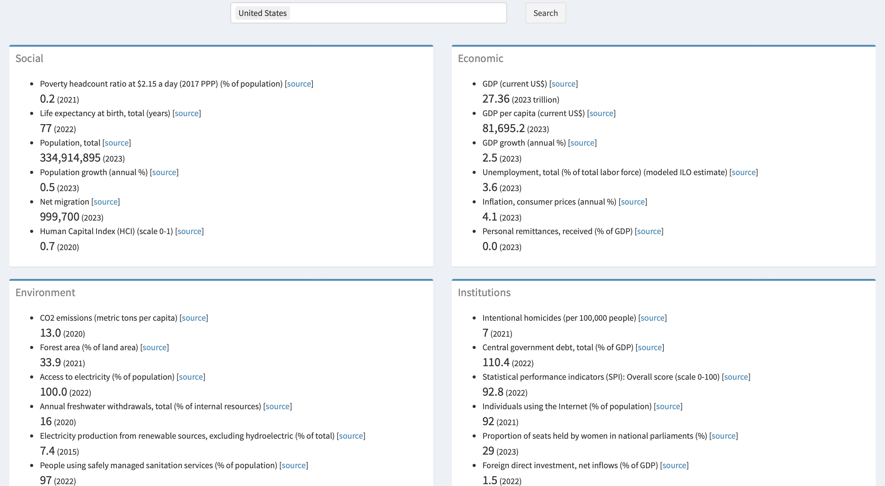

I developed this dashboard to allow users to explore and compare key social, economic, environmental, and institutional indicators for different countries.

Users can select one or more countries and retrieve the most recent data on these indicators from the [World Bank](https://data.worldbank.org/country) (WB), which is then displayed in a user-friendly format.

This project was a great learning experience in both Shiny development and web scraping, and I hope it will be useful to others who are interested in this field.

Source code: https://github.com/Fahim-Ahmad/wb_indicators/tree/r-shiny

> I've also developed a similar app using Streamlit in Python, which you can access via the source code [here](https://github.com/Fahim-Ahmad/wb_indicators) and the app [here](https://wb-indicators.streamlit.app).

Please click on the image below to use the R-Shiny dashboard:

